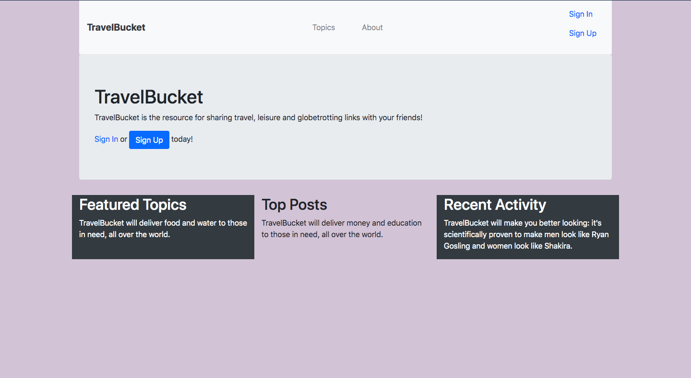
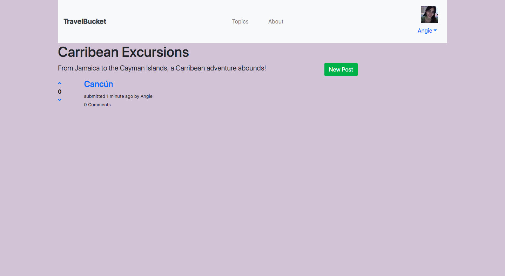
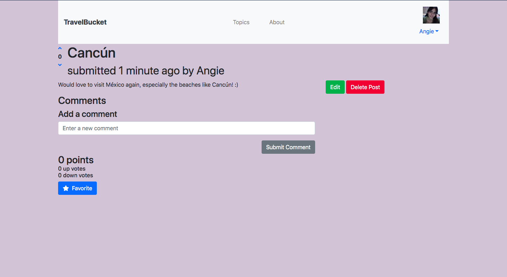

# TravelBucket

View working demo here: https://travelbucketapp.herokuapp.com/

## Description
TravelBucket is the travel enthusiast's go-to app. Users can post, vote on, and save links and comments. Users must sign up for the service in order to start contributing posts and comments with the app providing Standard and Premium memberships. TravelBucket users will need to be able to create posts as well as comment on those posts. TravelBucket users can also save posts as favorites listed on a separate Favorite table in ActiveRecord.

## Technologies Used:

Ruby, Ruby on Rails, RSpec, Bootstrap 4

## Getting Started

# Installing

Make sure you have installed Ruby and Ruby on Rails

`git clone git@github.com/ARodriguezHacks/travel-bucket-app.git` or create a fork.

## Usage

```
class PostsController < ApplicationController
  before_action :require_sign_in, except: :show

  before_action :authorize_user, except: [:show, :new, :create]

  def show
    @post = Post.find(params[:id])
  end

  def new
    @topic = Topic.find(params[:topic_id])
    @post = Post.new
  end

  def create
    @topic = Topic.find(params[:topic_id])
    @post = @topic.posts.build(post_params)
    @post.user = current_user

    if @post.save
      flash[:notice] = "Post was saved."
      redirect_to [@topic, @post]
    else
      flash.now[:alert] = "There was an error saving the post. Please try again."
      render :new
    end
  end
```

## Screenshots






