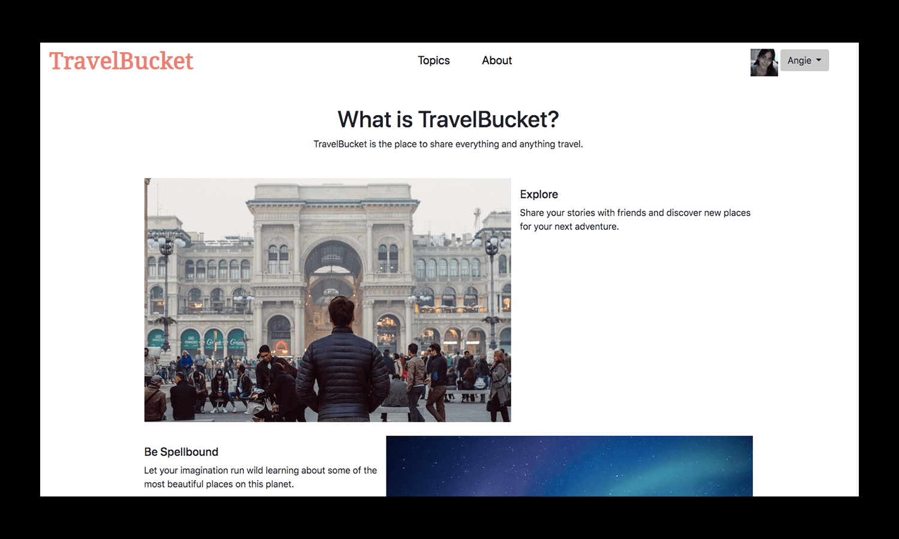
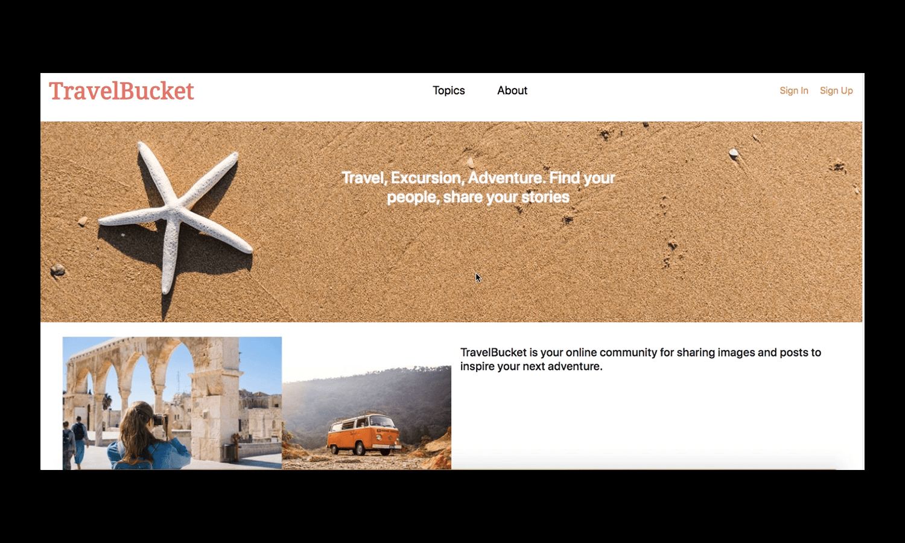
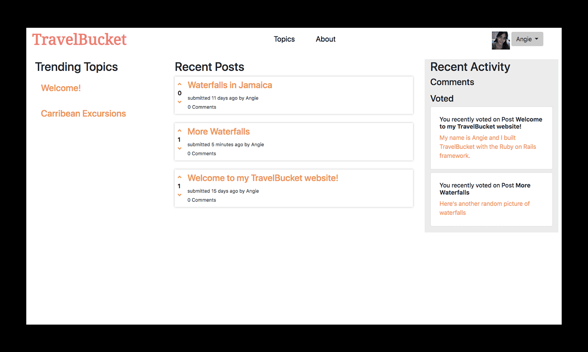
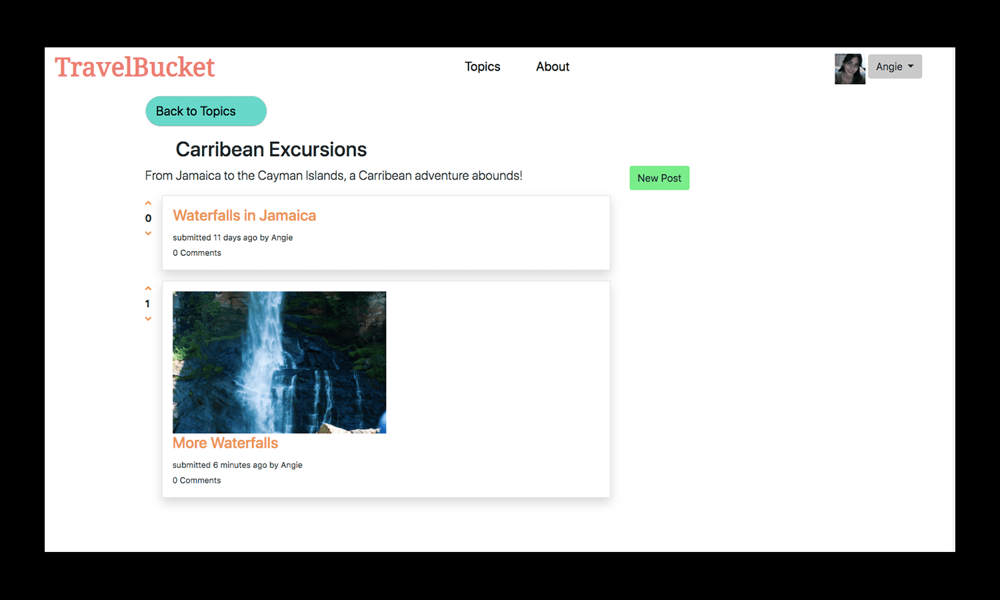

# TravelBucket

## Description
TravelBucket is the travel enthusiast's social media app. Users can read and write posts, upload images, comment on fellow users' posts and keep the conversation going on all things travel. With so many social media apps out in the interwebs, sometimes it's refreshing to find a place (or places) devoted to the same topic. 

Users must sign up to start contributing, with the app providing Standard and Premium memberships. Users first start out as Standard members, but can become Premium members through invitation. Only Premium and Admin members can create new topics, but additional features abound for any casual user of TravelBucket. 



## Viewing the Project

You can view a working demo on Heroku: https://travelbucketapp.herokuapp.com/

# Getting Started

## Installing

Make sure you have Ruby and Ruby on Rails installed before getting your development environment running.

If you have a Mac, Ruby should already be installed but you can check by typing in your terminal/command line `ruby -v` to check if you Ruby installed and its version:

`$ ruby -v`

The same goes for Rails:

`$ rails -v`

If nothing comes up, here are some excellent guides for installing Ruby and Ruby on Rails:

https://www.ruby-lang.org/en/documentation/installation/

http://www.installrails.com/

Once you have both Ruby and Rails installed on your local server, clone this respository

`$ git clone git@github.com/ARodriguezHacks/travel-bucket-app.git`

or

`$ git clone https://github.com/ARodriguezHacks/travel-bucket-app.git your-preferred-name-for-project`

Change directory (`cd`) into your newly cloned directory:

`$ cd travel-bucket-app` or `$ cd your-preferred-name-for-project`

Inside your project directory run `bundle install` to install the project's gems:

`$ bundle install --without production`

Create the project database

`$ rails db:migrate`

TravelBucket has a seed file with data readily available. If you want to populate your app with seed data run the following command:

`$ rails db:seed`

Now you're ready to run the rails server on your local machine

`$ rails server`

Navigate to http://localhost:3000/ on your browser and the TravelBucket landing page should appear:



## Technologies Used:

* Ruby / Rails
* RSpec 
* Bootstrap 5 (CSS)

## Features

* Complete suite of CRUD actions for posts, images, and comments (and topics for admin users)
* Ability to favorite posts
* Ability to upvote and downvote on posts
* A user profile page which outlines the user's created posts, comments, and favorites
* User avatar generator through Gravatar (You must sign up for a Gravatar account for your avatar to appear)
* Password reset assistance

_Successful log-in_ <br />


## Sample Code

The example code below is the User model. Through ActiveRecord associations, User model here is indicating that posts, comments, votes and favorites can only be created by having a user attribute

```
class User < ApplicationRecord
  has_many :posts, dependent: :destroy
  has_many :comments, dependent: :destroy
  has_many :votes, dependent: :destroy
  has_many :favorites, dependent: :destroy
  before_save { self.email = email.downcase if email.present? }
  before_save { self.role ||= :member }

  validates :name, length: { minimum: 1, maximum: 100 }, presence: true

  validates :password, presence: true, length: { minimum: 6 }, unless: :password_digest
  validates :password, length: { minimum: 6 }, allow_blank: true

  validates :email,
            presence: true,
            uniqueness: { case_sensitive: true },
            length: { minimum: 3, maximum: 254 }

  has_secure_password

  enum role: [:member, :admin]
  
  ...
  
```

## Additional Screenshots





_Landing Page when logged out_</br>


## How to Contribute

If you would like to contribute to TravelBucket please send an email to angrodri902@gmail.com.
